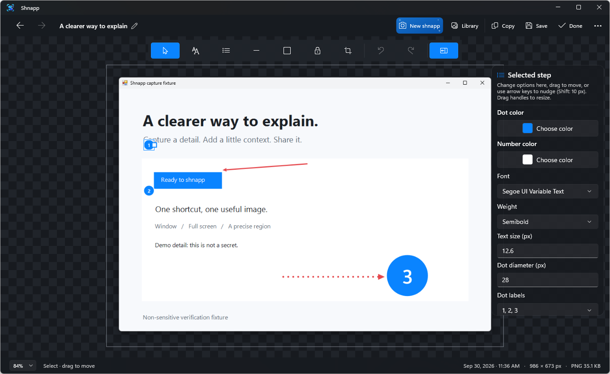
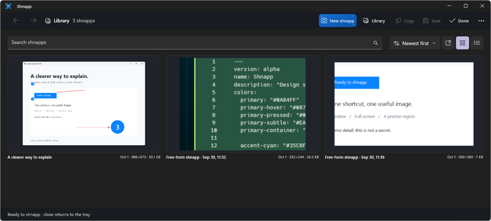

<p align="center">
  
</p>

<h1 align="center">Capture first. Think less.</h1>

<p align="center">
  Press a shortcut. Show what matters. Share a clearer picture.
</p>

<p align="center">
  <strong>Made for Windows 11 · Native WinUI · Local by default</strong>
</p>

Shnapp waits quietly in your tray until you need it. Capture part of your screen, add a little context, then copy the finished image or save a PNG. Every capture is a **shnapp**; making one is **shnapping**.



*A real Shnapp editor session. Your capture stays in view while the tools stay close.*

## Make a shnapp

| Shortcut | What it captures |
| --- | --- |
| `Ctrl+Shift+4` | A window you choose |
| `Ctrl+Shift+3` | The display under your pointer |
| `Ctrl+Shift+2` | A region you drag out |

You can start any capture from the tray icon or **New shnapp** in the app, too. Region capture currently uses a rectangle; a drawn free-form selection is on the [roadmap](ROADMAP.md).
The grabber freezes the visible desktop as capture starts, so moving content holds still while you choose. It shows a crosshair and live X, Y, width, and height in pixels as you drag. Hold Shift while choosing a region to make it square. A bright pulse frames the window or display being captured. Window shnapps use the visible pixels from that frozen moment, including anything overlapping the window.

## Explain it in a few clicks

The editor gives your capture room to breathe. Place a mark and it stays selected: changes in the side panel update that mark right away. Select an earlier mark to adjust it, or drag its handles to resize it. When nothing is selected, your choices set up the next mark.

Paste with `Ctrl+V` to turn copied words into an editable text mark or a copied picture into a movable image. If either reaches past the capture, Shnapp grows the transparent canvas around it. Remove or move that mark and the unused space falls away.

- **Text:** click once to write without a box; your words can grow in width or across lines. Drag to draw a fixed width and height when text needs to fit a specific space. Choose whether overflow is clipped or ends with an ellipsis, align or justify the text, and set its line height. Both styles offer font, weight, italic style, size, color, kerning, letter spacing, and case controls. Press Enter for another line, `Ctrl+Enter` to finish, or double-click placed text to rewrite it.
- **Steps:** place dots labeled with numbers, letters, or Roman numerals. Restart the count at any dot, and adjust its size, colors, font, and weight. The next dot keeps your last size.
- **Lines and shapes:** use one line tool for solid, dashed, or dotted strokes. Choose a cap for either end: triangle, open arrow, circle, diamond, bar, or none. Draw rectangles, squares, ellipses, and circles with adjustable outlines and fills, including fill-only shapes.
- **Privacy:** choose Cover, Blur, or Pixelate for a rectangular area. Use opaque Cover for sensitive details; Blur and Pixelate only obscure the view.

Draw a crop and drag it into place, use exact X, Y, width, and height values, lock proportions, or pick a ratio such as 1:1, 9:16, or 5:7. Scroll the canvas to zoom; hold Space and drag with the hand cursor to pan with a short, gentle glide. Hold Shift while moving a mark to keep it on one axis, or while resizing to keep its proportions. Nudge a selected mark with the arrow keys, one pixel at a time or ten with Shift. Click a number field, then scroll to change it by one; hold Shift for ten. Undo or redo as you go. Window captures get a soft drop shadow by default.

Right-click any placed element to clone it, delete it, or change which marks sit in front. The same actions work from the keyboard: `Ctrl+D`, `Delete`, `Ctrl+]` (front), and `Ctrl+[` (back).

When it looks right, **Copy** (`Ctrl+C`) puts the finished image on your clipboard with its transparent areas intact, **Save** (`Ctrl+S`) lets you export a PNG, and **Done** returns Shnapp to the tray. The toolbar menu also offers Windows Share, Copy full path, and Delete shnapp.

## Find it again

Shnapp keeps your captures in a local library, ready to search by title, last saved date, or capture type and reopen for more editing. Browse as a list or choose small, medium, large, or extra-large thumbnail grids. Each shnapp shows its last saved date, dimensions, and PNG size; sort by any of those or by name. A new mark or pasted image refreshes its preview when you return to the library. Right-click a shnapp to clone, rename, share, delete, or copy its saved PNG path. Hover over a grid thumbnail to reveal its checkbox at the bottom right, or use the always-visible checkboxes in list view. Once you select a shnapp, **Delete** appears beside search for bulk cleanup. The Back and Forward buttons return you to places you visited; `Alt+Left` and `Alt+Right` work too, as do mouse Back and Forward buttons. Click the title above an open shnapp to rename it. When the library is empty, a getting-started view helps you take the first shnapp. Opt in to starting at sign-in if you want Shnapp waiting in the tray whenever Windows starts.

While editing, move to the canvas's left edge to reveal a small image-only gallery over your work, or open it with `Ctrl+Shift+G` or **Recent shnapps** in the menu. Hover to magnify nearby previews, use the arrows or scroll to browse, click a preview to open it, or drag one onto your canvas to add a copy as a movable image layer. Small cropped previews keep browsing quick.



*Your shnapps stay on this PC, with previews that make the right capture easy to find.*

## Your captures stay yours

Shnapp saves its library and preferences under `%LOCALAPPDATA%\Shnapp` for your Windows user account. Capturing and editing require no account or internet connection. Copied and exported PNGs have the chosen Cover, Blur, or Pixelate effect baked in. The editable original remains in your local library, so share the finished PNG rather than a library file when something sensitive was covered. For private information, choose opaque Cover; blurred or pixelated details may still be recognizable.

## Get started

Shnapp is an early preview for Windows 11 on x64 and ARM64. A public installer or GitHub Release has not been published yet. You can [build it from source](#build-from-source) today. Follow the [roadmap](ROADMAP.md) for planned captions, output resizing, polygon shapes, true free-form capture, and optional AI assistance. Visit [shhnap.com](https://shhnap.com/) for the product website; its [source](src/Shnapp.Site) lives alongside the app.

### Build from source

On Windows 11, install the .NET SDK specified in `global.json` and a WinUI 3 development toolchain. Then run:

```powershell
dotnet build src\Shnapp.App\Shnapp.App.csproj -c Debug -p:Platform=x64
.\src\Shnapp.App\bin\x64\Debug\net10.0-windows10.0.26100.0\win-x64\Shnapp.exe
```

For ARM64, use `-p:Platform=ARM64`; its output is under `bin\ARM64\Debug\...\win-arm64`.
